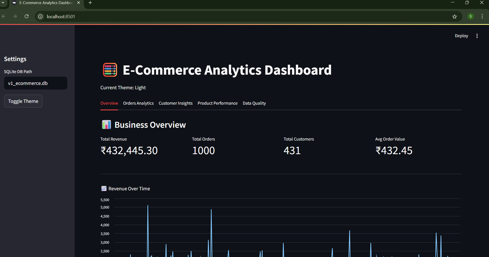
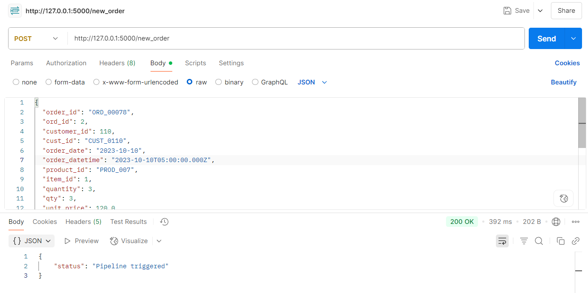
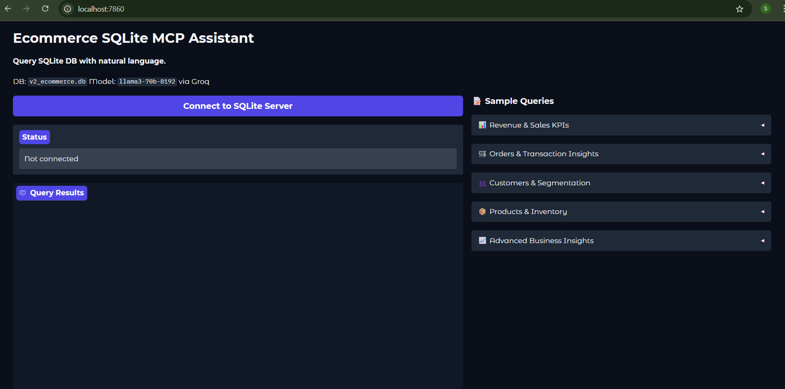
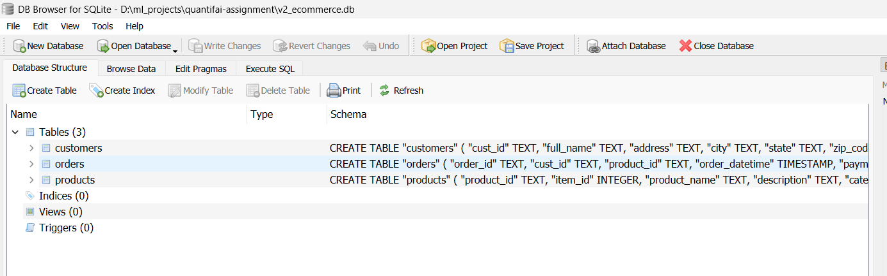

# 🛍️ E-Commerce ETL Pipelines (Static vs Dynamic)

## 🧠 Project Overview

This repository contains an end-to-end data engineering solution. It covers:

- V1: A static ETL pipeline loading data from local e-commerce CSV and JSON files into SQLite, with a Streamlit dashboard.
- V2: A dynamic ETL pipeline triggered by simulated external API (via Postman) and real-time transformation and loading, with interactive querying via Gradio chat and SQLite MCP server.
- Bonus Task: AI-powered customer data reconciliation using fuzzy matching, Gemini AI schema inference, and rule-based matching logic.

---

## 📂 Project Structure

├── v1_static_pipeline/              # Static ETL pipeline using local data  
│   ├── app.py                       # Streamlit dashboard  
│   ├── etl/                         # Extract-Transform-Load modules  
│   ├── datasets/  
│   └── v1_ecommerce.db  
├── v2_dynamic_pipeline/             # Dynamic pipeline triggered by API  
│   ├── app.py                       # Gradio interface  
│   ├── etl/  
│   ├── db-chat-llm/  
│   └── v2_ecommerce.db  
├── data_discovery_analysis.ipynb    # Exploratory data analysis  
├── requirements.txt  
└── README.md  


---

## 🧱 Architecture Overview

### 🔹 V1: Static Pipeline

- ✅ Extract: Load CSV/JSON from local files
- 🛠️ Transform: ETL functions (cleansing, merging, normalization)
- 🧬 Load: Save output into SQLite database
- 📊 Visualize: Business KPIs via Streamlit

### 🔸 V2: Dynamic Pipeline

- 🚀 Trigger: External POST API (simulated via Postman)
- ⚙️ Pipeline: Extract → Transform → Load (automated per POST)
- 🗃️ DB: SQLite for storage
- 💬 Query: Chat with DB using Gradio interface (MCP server)

---


## 🖼️ Visuals

### 🔷 Static Streamlit UI (V1)


### 🔷 Postman API Call (V2)


### 🔶 Dynamic Chat UI with Gradio (V2)


### 🗂️ SQLite View


---

## ⚙️ Setup Instructions

1. 🧬 Clone Repository

```bash
git clone https://github.com/geekatbest/etl-pipeline-mcp.git
cd etl-pipeline-mcp
```

2. 📦 Create Python Environment
```bash
conda create -n etl python=3.11
conda activate etl
pip install -r requirements.txt
```

3. ▶️ Run V1 Static Pipeline
``` bash
cd v1_static_pipeline
streamlit run app.py
```

4. ▶️ Run V2 Dynamic Pipeline
``` bash
cd v2_dynamic_pipeline
uvicorn servers-archived.db_chat_llm_server:app --reload
python app.py
```
5. 🧪 Trigger Dynamic Flow via Postman
``` bash
POST http://127.0.0.1:5000/new_order
```
Attach your simulated files in the body.

## 🛠️ Tech Stack & Tools

| Tech         | Description                  |
|--------------|------------------------------|
| 🐍 Python     | Core language                |
| 🐼 Pandas     | Data manipulation            |
| 📊 Matplotlib | Visualizations               |
| 📈 Streamlit  | Dashboard (V1 UI)            |
| 💬 Gradio     | Chat interface (V2)          |
| 💾 SQLite     | Lightweight DB               |
| 📬 Postman    | API testing                  |

---

## 🧩 Challenges & Solutions

| Challenge                       | Solution                                |
|--------------------------------|-----------------------------------------|
| Schema mismatches in raw data  | Custom coercion + schema normalization  |
| Realtime ETL on POST trigger   | FastAPI + internal orchestration        |
| Insight querying from DB       | sqlite-chat + Gradio chat wrapper       |

---

## 🚀 Future Improvements

- Add test coverage for ETL modules  
- Add schema validation layer before DB load  
- Enhance NLP query handling with LangChain  

---

## 👩‍💻 Author

**Sarvesh Bajare**  
Third-year Instrumentation Engineering  
Interests: Gen AI, data science, deep learning
